# Get-a-Service-Android-project

<h1> App Name: Get-a-Service</h1>
<h2>App Logo<h2>
 
 
 

<h2>Team Members:</h2>
 <li>1. Suma Soma</li>
 <li>2. Mohan Pratapa </li>
 <li>3. Chetan Kudaravalli</li>
 <li>4. Manideep Chamala</li>

<h2> Introduction to our Project:</h2>

We live in an era where technology is advancing. Even as technology has simplified our lives to a great extent, finding labor is still a challenge.

 There are many unskilled workers who have a great ability to fix problems of our daily needs like if there is a problem with our furniture, TV, plumbing problems.

Through this App we can book the laborer based on GPS location and rating of employees, a message is sent to the person concerned, who may respond to it based on availability.
 

 
 The main purpose of this app is to supply labor and service on demand. 

<h2>Support Version:</h2>

We are using android API version of 9.0-API 28 in GENY MOTION. The size of the layout is 1440x3040 with a density of 560. 
The complete details of the device we have used in our project is:
Device Name: Samsung Galaxy S10
Android API: 9.0 API 28
Size: 1440*3040 in Genymotion

<h2> APK File:</h2>
https://github.com/suma-gitrep/Get-a-Service/blob/master/app-debug.apk

<h2>Installation Steps</h2>
<ul>
Installation of this app is much more easier with just few steps
Apk file of the Get a serivce App can be downloaded by the user.
By clicking on the apk file, It install's the app in your android mobile.
Once the App gets installed the user can click on the App icon to open it.
Later on, the user can register into the app and can buy services from our workers whenever they need.
</ul>

<h2>Requirements:</h2>

<ul>
Mobile with the Android operating System.
We need the above API properties to run the app and to have good user interface.
Minimum 1 GB RAM.
Minimum 8 GB internal storage
To run this app we need internet.
</ul>

<h2>Sources used for our Project:</h2>

https://www.androidhive.info/

https://www.youtube.com/watch?v=TwHmrZxiPA8

<h2>Test Credentials</h2>
Usename: chetan
Password: chetan@1997

<h2>App Flow</h2>
The below screenshots are illustrating about the work flow of the app. This is home pageof the app.

When user first opens the app, it would ask for permission to access the location of the device to get current location.

 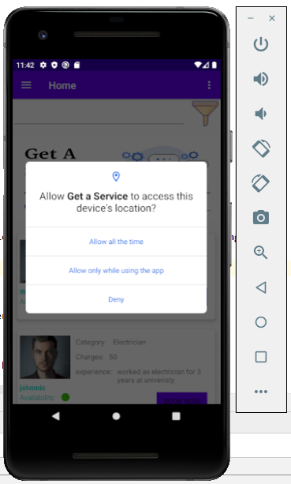
 
 And this actual home page,
 
 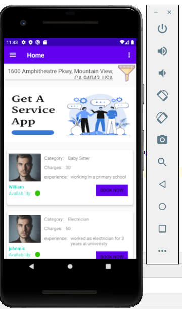
 
 From This Navigation Drawer user can access the Following Page:
 
 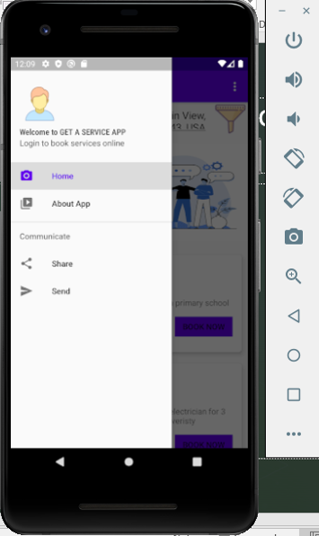
 
 
 After entering all the details, when user clicks on the Register 	Button it checks all validations for the fields, if everything is fine it 	saves the user in firebase real time database. 
 
 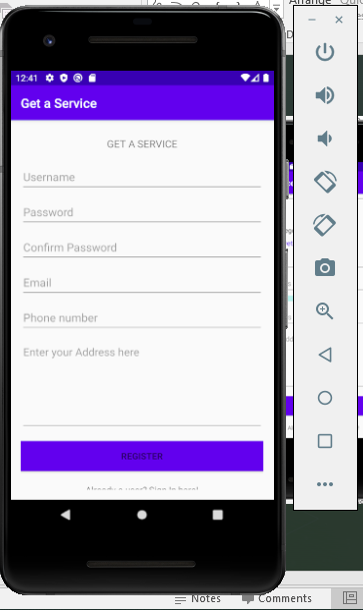
 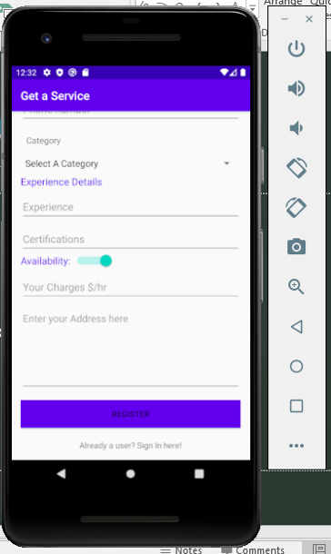
 
 User can login by entering username and password.
 
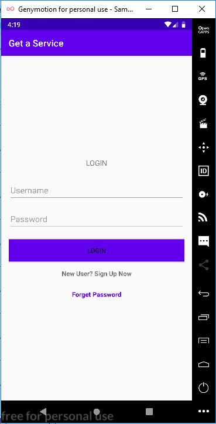

If user forgets his password, he could change his password by entering his email. Where he can get the rest the password link.

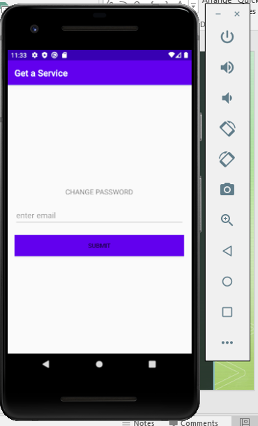

After Login, user can see the my bookings fragment. And user can book an appointment by giving the details of the day and timings.

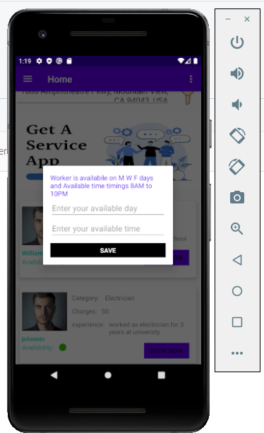
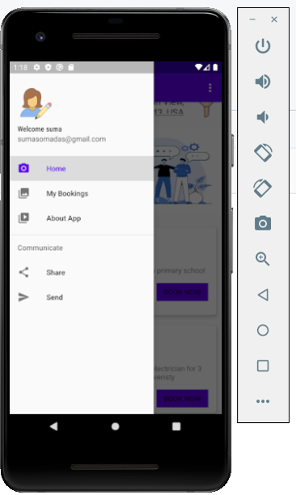

User can view his booking history in this page.

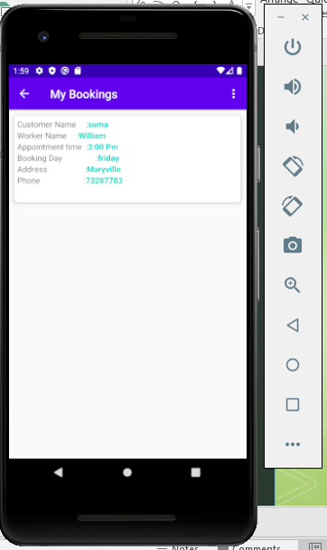

customer or worker can edit their information.

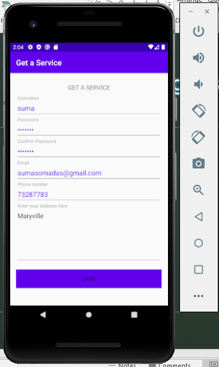
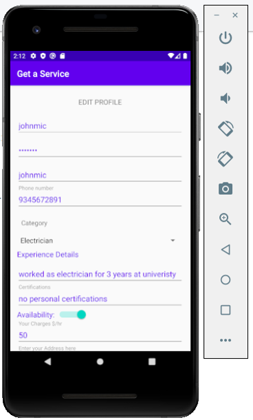

This page shows the details of Get A Service App. How it works 	and how this can be used.

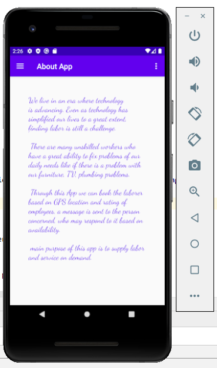

User can share Get A Service app google play 	services url.

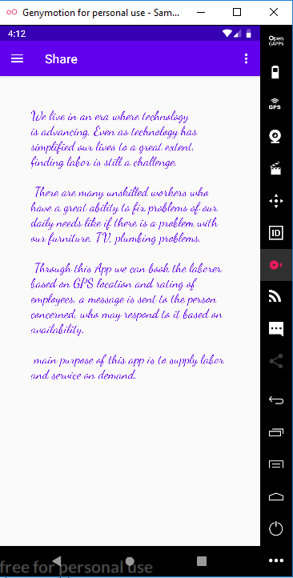

User can send messages about the Get A Service App.

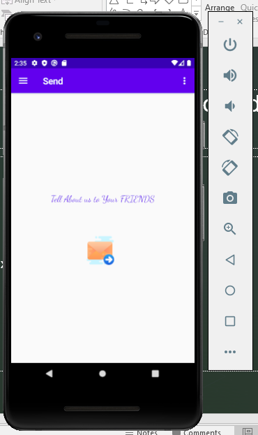

 
 
 

 
 

 
 <h2>Contribution Link:</h2>
https://github.com/suma-gitrep/Get-a-Service/graphs/contributors

